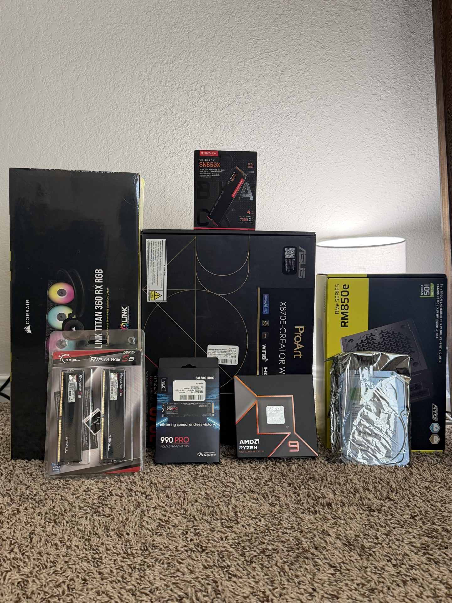
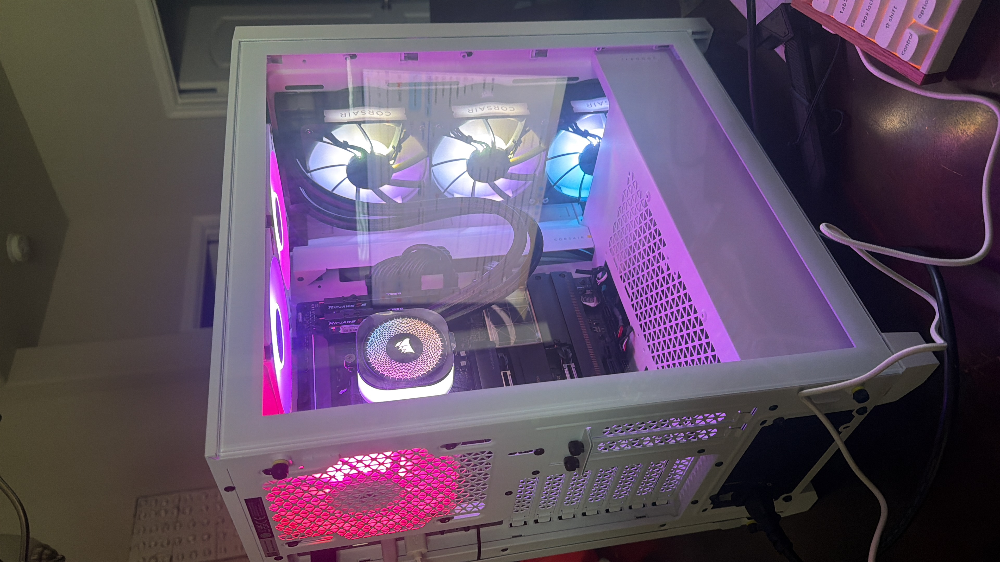

# Why I Built This PC
I wanted to learn how to build a PC from scratch, and I needed a machine powerful enough to run real hacking labs. 
My goal was to gain hands-on experience and practice for my A+ certification preparation before starting my first semester at the University of Houston. 
I researched every component, selected the parts myself, and successfully built the PC.


## The Build - "Cyber"
I named it Cyber. Here's what's inside:

| Components   |   Parts        | 
|:-------------|:------------------|
| CPU          | 	`AMD Ryzen 9 9950X — 16 Cores / 32 Threads` | 
| Cooler       | 	`Corsair iCUE Link Titan 360 RX RGB AIO`   |
| Motherboard  |  `ASUS ProArt X870E-Creator WiFi`      | 
| RAM          | `G.Skill Ripjaws S5 64GB DDR5-6000 CL30` | 
| OS Drive     |  `Samsung 990 Pro 2TB NVMe Gen4`              |
| VM Drive     |  `WD Black SN850X 4TB NVMe Gen4`              |
| Cold Storage |   `Seagate BarraCuda 4TB HDD`             |
| PSU          |   `Corsair RM850e 850W Gold Fully Modular`             |      
| Case         |   `Corsair iCUE 4000D RGB Airflow ATX Mid Tower Case`             |      
| OS           |  `Windows 11`              |
| Monitor      |   `Dell 27 Monitor S2725QS, 4K UHD IPS, 120hz`              |     
| Keyboard     |    `Keychron K2 HE`            |     
| Mouse        |     `Logitech MX Master 3S`            |        

Total Storage:  `10TB` 


## What I Built It For

This machine is set up specifically for cybersecurity lab work:
- Running multiple virtual machines at the same time — Kali Linux, Windows
- Practicing on platforms like TryHackMe, HackTheBox, and VulnHub
- Learning network analysis with Wireshark
- Preparing for CompTIA Security+

 `The 16-core CPU and 64GB of RAM means I can run a full lab environment without the machine slowing down.
 The 4TB NVMe is dedicated entirely to VMs so they run as fast as a real machine.`


## What I Learned Building It
I had never built a PC before this. Here's what I had to figure out:

*   How to install an `AMD RYZEN 9` CPU into an `Asus ProArt X870E Creator Wi-Fi` motherboard
*   How AIO liquid coolers mount and connect
*   The difference between NVMe, SATA, and HDD storage and when to use each
*   How to configure dual-channel RAM correctly
*   Why integrated graphics are enough for cybersecurity work without a GPU
*   Cable management inside a mid-tower case
*   How to Install Fans Correctly with the Right Airflow Inside a `Corsair 4000D` case

  `Everything I know about PC hardware I learned while building this.`

## Difficulties that I faced

1.  Installing the AIO pump was one of the challenges I faced.
    I learned that every motherboard has its own method for installing the pump; Intel is different from AMD.
    I also had to unscrew the fans in the radiator and reverse their orientation to achieve the desired airflow inside the case.

2.  Cable management was a challenge, ensuring that every cable was well placed and reached its corresponding plug on the motherboard.
    Organizing them to prevent mixing was also difficult.

## Confirmed System Specs
Verified in Windows 11 — System > About:
  1. AMD Ryzen 9 9950X 16-Core Processor (4.30 GHz)
  2. 64.0 GB RAM @ 6000 MT/s
  3. 9.10 TB Storage
  4. AMD Radeon Integrated Graphics (2GB)


## What's Next 
  - Document each lab on this GitHub
  - Earn CompTIA A+
  - Set up Kali Linux VM in VMware Workstation
  - Complete TryHackMe Pre-Security path

## About me:

`Incoming Computer Science student at the University of Houston — Fall 2026.
My goal is a career in cybersecurity as a security engineer.
I built this machine because I believe in learning by doing.`
[Link to another page](README.md).

### Before



### Final Build




### Definition lists can be used with HTML syntax. 


<dl>
<dt>Name</dt>
<dd>Godzilla</dd>
<dt>Born</dt>
<dd>1952</dd>
<dt>Birthplace</dt>
<dd>Japan</dd>
<dt>Color</dt>
<dd>Green</dd>
</dl>

```
Long, single-line code blocks should not wrap. They should horizontally scroll if they are too long. This line should be long enough to demonstrate this.
```

```
The final element.
```
